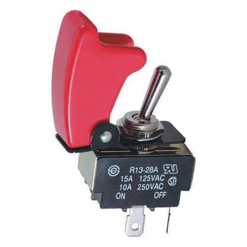

# Thrust Stand

## Setup Instructions

Minimum hardware requirements:
- Toggle Switch - Configured as button 1 in AP button library.
- 10 Addressable LEDs for throttle bar. (not used in Thrust_Stand_Simple.Lua)
- SparkFun Qwiic Scale - NAU7802.  Only 1 is required for Thrust only measurements. A second is required for the optional torque measurement.  Note: to use two of these load cells either your flight controller must have 2 I2C buses available or you need an MUX, as the addresses are not configurable on those devices.

Firmware requirements:
- Thrust_Stand.Lua requires building copter from this branch.
- Thrust_Stand_Simple.Lua should run on stable copter (4.4 onwards).

## Connections & Setup
- Thrust load cell amplifier must be connected to I2C bus 1.
- Optional Torque load cell amplifier must be connecter to I2C bus 2 and THST_ENAB_TORQ must be set to 1.
- A toggle switch must be configured as button 1, to act as a safety switch (see: https://ardupilot.org/copter/docs/common-buttons.html)

## Calibrations

The load cell outputs a unitless number that requires calibration parameters to convert to loads in your desired units.  To calibrate, apply known loads to the load cells to derive the necessary calibration parameters.  For each load cell a gradient and an offset are required.  The calibration parameters to be set are:
- **THST_CAL0_THST:** Thrust load cell calibration, zero offset.
- **THST_CALM_THST:** Thrust load cell calibration, gradient.
- **THST_CAL0_TORQ:** Torque load cell calibration, zero offset.
- **THST_CALM_TORQ:** Torque load cell calibration, gradient.

Apply a series of different loads (weights are often the easiest) and look at the corresponding MAV_THST_RAW or MAV_TORQ_RAW telemetry streams on the GCS.  Plotting raw output vs applied load should give you a straight line.  Calculate the gradient and zero offset using a line of best fit (linear regression).  Enter the obtained values into the parameters mentioned above.  Finally, re-apply a load and check either MAV_THRUST or MAV_TORQUE on the GCS to make sure that the reported value matches the applied load.

-  Raw measurement from the thrust load cell amplifier.
- **MAV_TORQ_RAW:** Raw measurement from the torque load cell amplifier.

## Checklists

### Power on Checks
-	Power Supply set to standby.
-	Switch on Power Supply.
-	Check voltage and current limits.
-	Remove standby.

### “Pre-Flight” Checks
-	Thrust load cell reporting correctly.
-	Torque Load cell reporting correctly.
-	Set THST_CUR_LIM
-	Check RPM1_SCALE = 1
-	Set MOT_SPIN_MIN (motor test) [THST_ENBL_TEST = 1]
-	Check for linearisation enables [THST_USE_LIN]
-	Check MOT_SPIN_MAX = 1.0
-	Check MOT_PWM_MIN (usually set 1000)
-	Check MOT_PWM_MAX (usually set 2000)
-	Run up to 50% throttle check.
-	Calibrate Thrust and Torque

### Test Checks

- Set test mode.

#### Throttle Ramp Mode

-	Set THST_HOLD_S (s) to the length of time to hold throttle at each step.
-	Set THST_MAX_THR (%) [0 - 100] to set the max throttle.
-	Set THST_RAMP_STEP [0.01 - 1.0]

#### Transients / Step-Change Mode
-	Set THST_HOLD_S (s) to the length of time to hold the step change.
-	Set THST_MAX_THR (%) [0 - 100] to the max throttle to set the step change to.
-	Set MOT_THST_HOVER [0.0 - 1.0]
Note: Throttle will step hover throttle +/- (max throttle – hover).  Ensure set to allow symmetric steps.

#### Frequency Sweep / Throttle Chirp Mode
-	Throttle/thrust output is between MOT_SPIN_MIN and MOT_SPIN_MAX
-	Set THST_HOLD_S (s) to the length of time to hold the initial trim state. Usually set 3 s.
-	Set THST_MAX_THR (%) [0 - 100] to the max throttle to set the step change to.
-	Set MOT_THST_HOVER [0.0 - 1.0] this is the centre/mean of the sin wave
-	Set THST_NSE_RAT – the noise ratio or amplitude.
-	Set THST_OMEGA_MIN (rad/s) (default = 0.3)
-	Set THST_OMEGA_MAX (rad/s) (default = 12)

##### Test Procedure:
- Log air temperature, relative humidity, and pressure.
- Arm ArduCopter via GCS.
- Switch toggle safety switch.
- Throttle will ramp up and test will begin.
- Test will be performed  automatically, as per configuration.
- Throttle will ramp down and sit at MOT_SPIN_MIN once test has completed.
- Switch toggle safety switch to both safe and disarm system.

## Test Modes

Copter flight modes are used as a proxy for thrust stand modes. The below describes which copter modes correlates to the thrust stand modes.

You must set the flight modes below, via the GCS, to use the corresponding thrust stand modes described below.

- **Stabilise:** Stepped throttle ramp for expo calculations
- **Alt_Hold** - Throttle mode hold, ramps to THST_MAX_THR and holds for THST_HOLD_S
- **Acro** - Throttle steps, ramps to MOT_THST_HOVER, and then step changes to THST_MAX_THR
- **Guided_NoGPS** – (System ID) Throttle chirps/frequency sweeps

## Parameter Definitions
- **THST_CAL0_THST:** Thrust load cell calibration, zero offset.
- **THST_CALM_THST:** Thrust load cell calibration, gradient.
- **THST_CAL0_TORQ:** Torque load cell calibration, zero offset.
- **THST_CALM_TORQ:** Torque load cell calibration, gradient.
- **THST_CUR_LIM:** Current limit. If battery monitor measures a current above this value the throttle will be instantly zeroed and the test will stop.  Safety switch has to be cycled to allow another test to start again.
- **THST_MAX_THR:** Maximum throttle used. In a ramp test the throttle will ramp between 0 and max.  In all other test modes the throttle will be constrained by this value. 0 to max throttle is within spin min and max.
- **THST_HOLD_S:** Hold time in seconds.  In ramp test, this is the step dwell time.  In the transient, step test, this is the dwell time to hold the throttle at between step inputs.
- **THST_ENBL_TORQ:** Used to enable use of 2nd load cell for torque measurements. 0 = disabled, 1 = enable torque.
- **THST_ENBL_TEST:** Set to 1 (allow) to enable copters motor test from the GCS.  Whenever a thrust stand run is started this param is automatically returned to 0 (disabled) with a set and save.  This is required to stop the script from overriding the output when copter is trying to do its motor test.
- **THST_OMEGA_MIN:** Minimum frequency (rad/s) for throttle chirp test.
- **THST_OMEGA_MAX:** Maximum frequency (rad/s) for throttle chirp test.
- **THST_NSE_RAT:** Noise ratio to be applied during chirp test. Ratio of max throttle.
- **THST_RAMP_STEP:** Spacing between throttle steps in ramp test mode.  E.g. 0.1 = 10% throttle steps.
- **THST_USE_LIN:** – 0 = throttle control, 1 = thrust control.  When enabled thrust to throttle linearisation from multi-rotor code is used. **(Not enabled in Thrust_Stand_Simple.lua)**

- **MOT_PWM_MIN:** Copter MOT_PWM_MIN used in throttle output calculation. See here for definition: https://ardupilot.org/copter/docs/parameters.html#mot-pwm-min-pwm-output-minimum
- **MOT_PWM_MAX:** Copter MOT_PWM_MAX used in throttle output calculation. See here for definition: https://ardupilot.org/copter/docs/parameters.html#mot-pwm-max-pwm-output-maximum
- **MOT_SPIN_MIN:** Copter MOT_SPIN_MIN used in throttle output calculation. See here for definition: https://ardupilot.org/copter/docs/parameters.html#mot-spin-min-motor-spin-minimum
- **MOT_SPIN_MAX:** Copter MOT_PWM_MIN used in throttle output calculation. See here for definition: https://ardupilot.org/copter/docs/parameters.html#mot-spin-max-motor-spin-maximum

- **MOT_THST_EXPO:** Used in thrust linearisation calculation, if THST_USE_LIN is enabled.

- **MOT_THST_HOVER:** used for throttle step transient mode.  This is the middle throttle setting and the the throttle is stepped +/- THST_RAMP_STEP about this value.

## Live Outputs to GCS

Live telemetry data can be seen from the script. The following are output at 2 Hz:
- **MAV_THST_RAW:** Raw measurement from the thrust load cell amplifier.
- **MAV_TORQ_RAW:** Raw measurement from the torque load cell amplifier.
- **MAV_THRUST:** Calibrated thrust calculation from thrust load cell.
- **MAV_TORQUE:** Calibrated thrust calculation from torque load cell.

## Logging

All data is stored in ArduCopter *.bin log files. The thrust and torque data is stored in the **THST** log field.  All other data is stored in the usual log fields. E.g Battery monitor stores current and voltage data, RPM for rpm data etc.
